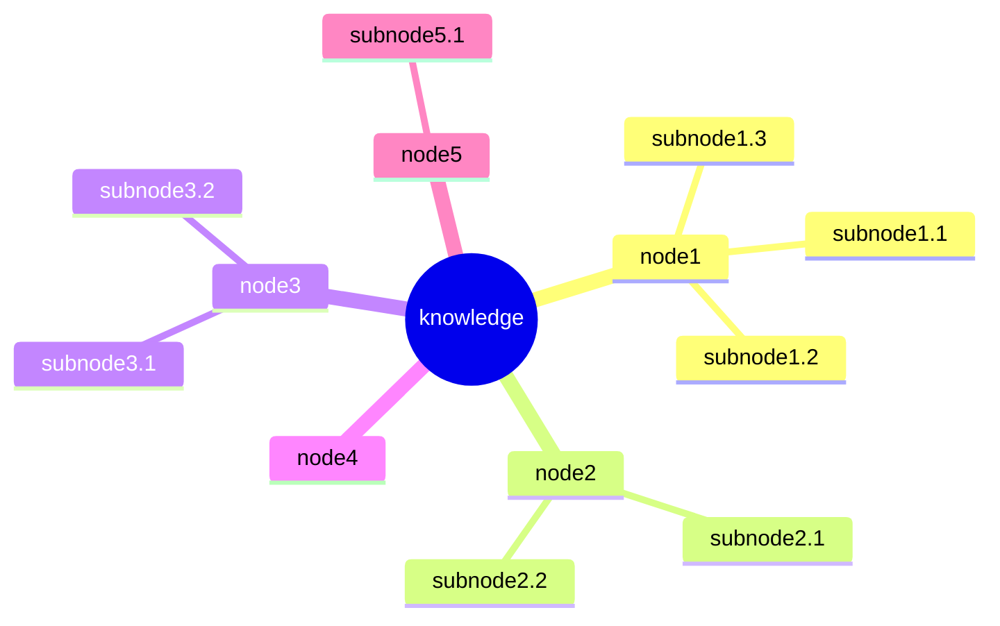

<!--
<form>
    <input type="button" value="expand" />
</form> -->

<!--

    

        <label for="toggle">knowledge</label>

        <input type="radio" id="toggle" class="visually-hidden button1" />

    

    
node1

    
subnode1.1

    
subnode1.2

    
subnode1.3

    
node2

    
subnode2.1

    
subnode2.2

    
node3

    
subnode3.1

    
subnode3.2

    
node4

    
node5

    
subnode5.1

-->